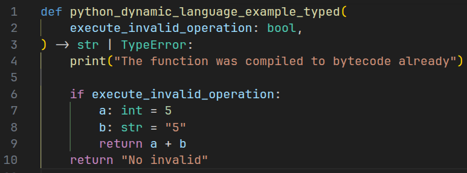
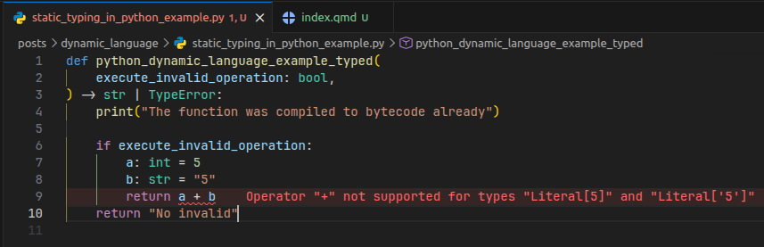

::: cell
{fig-align="center"}
:::

Today, I am going to talk about the characteristics of `Python`.

These are very common topics addressed in `Python` interviews. It allows the interviewer to know if the candidate knows the foundation of the language.

Have you ever received a `TypeError` while running your `Python` program?

It occurs because `Python` is a dynamic type language. It means the language verifies variable types during execution (`runtime`) - not during compilation, even though Python does compile your code into bytecode before running it. The type check only happens the instant an operation is actually executed, not when the code is first parsed and compiled.

Let's go with an example:

```{python}
def python_dynamic_language_example(execute_invalid_operation):
    print("The function was compiled to bytecode already")

    if execute_invalid_operation:
        a = 5
        b = "5"
        return a + b
    return "No invalid operation was found"
```

This function can run successfully even though there is an invalid operation inside the `if` clause:

```{python}
python_dynamic_language_example(False)
```

Moreover, since this is a [Quarto document](https://quarto.org/docs/computations/python.html), the mere fact that the whole `.qmd` file compiled successfully already shows the function was compiled to bytecode without error.

However, when we try to access the code portion that does the calculation, we receive the `TypeError`:

```{python}
#| error: true
python_dynamic_language_example(True)
```

which means that `Python` did not perform the operation because it was operated between two invalid `types`, even though it was compiled, as can be seen by `dis`:

```{python}
import dis
dis.dis(python_dynamic_language_example)
```

The fact that `Python` compiled this code, it means that it is **dynamically type**, instead of **statically typed**:

> Languages that verify the type of the variable before `runtime`, such as `Java`and `C++`, are known as `static type language`. The advantage of it is that in production you have more guarantees that your code will not break due to an accidental variable type change or operation. So, you know in advance that a mistake can occur.

The fact that `Python` did not allow that operation occur in `runtime` means that it is **strongly typed**, instead of **weakly typed**:

> Weak typed languages, such as `JavaScript` and `PHP` would allow this operation to occur. It would result in `"55"` (string) in `JavaScript` and `10` (integer) in PHP.

Having these concepts in mind can help you to think on which language to use, or anticipate errors.

## Flexibility in Python

Even though this is an odd behavior in Python, it allows you the change the variable type while programming:

```{python}
a = 5
print(type(a))
print(id(a))
a = "5"
print(type(a))
print(id(a))
```

It occurs because the `value` has a type (dynamic type language), not the `variable`. It also allows you to write less boilerplate code, and make your code into production faster.

## What if you want to put more restrictions in Python ?

In recent Python versions (3.x), what you can do is add type annotation to variables and output of functions. However, it will still allow the function to be compiled:

```{python}
def python_dynamic_language_example_typed(
    execute_invalid_operation: bool,
) -> str | TypeError:
    print("The function was compiled to bytecode already")

    if execute_invalid_operation:
        a: int = 5
        b: str = "5"
        return a + b
    return "No invalid"

dis.dis(python_dynamic_language_example_typed)
```

**However**, if you are coding in an editor and uses a tool that does live checking, such as `Pylance` in `Vs Code` in `standard mode`, it would warn you about the operation:

::: cell
{fig-align="center"}
:::

and you could fix it right away.

Happy coding!
