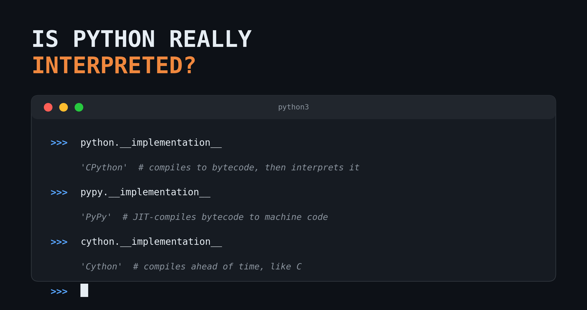
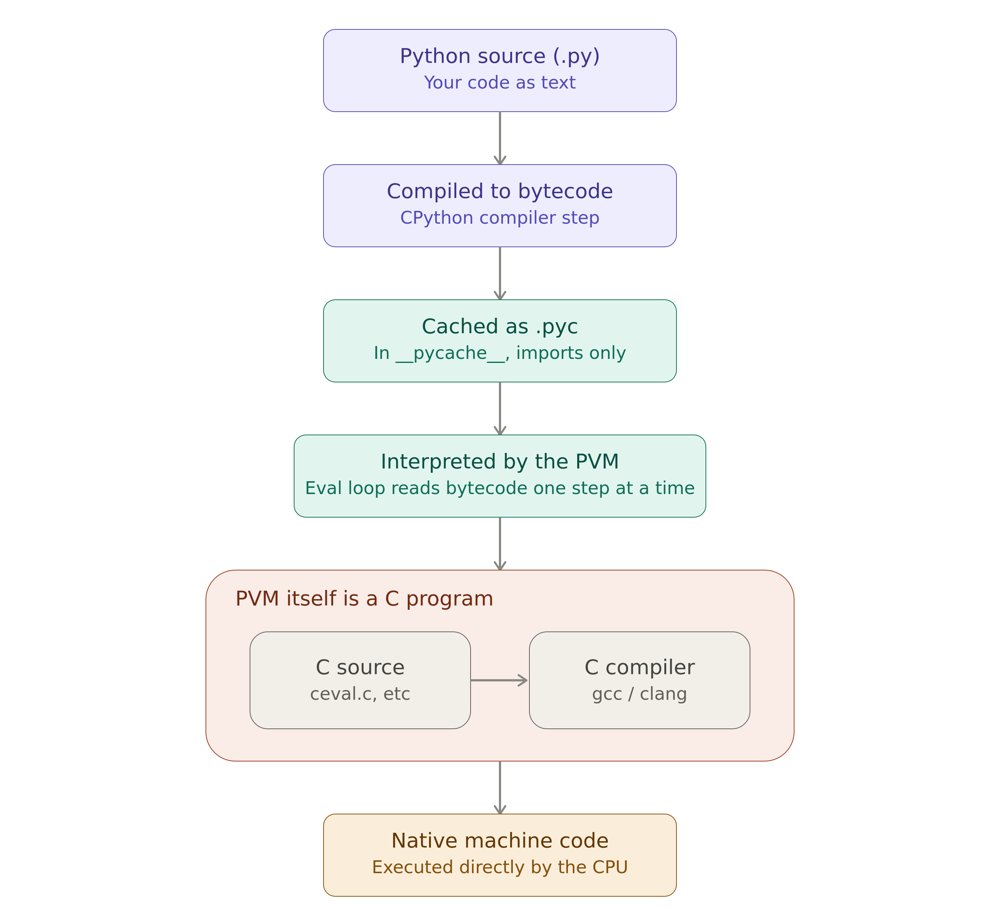

::: cell
{fig-align="center"}
:::

When I decided to study it, I felt the same as Naruto learning the Rasengan: It was difficult to learn: Naruto took 3 years to learn; and I took 10 😂, since I firstly heard the words "interpreted"/"compiled" language when I was learning R.

Python, itself is an interpreted language, and there are many nuances that I want to discuss.

Let's start by defining what is a programming language.

## Programming language

A programming language can be defined by two main pillars:

1. Specification (Rules):
   1. Syntax: how the code is written; some languages may be more verbose than others. For example, in `C` you need to define the type of each variable and finish the line with `;`. Whereas `Python` does not require it, but `indentation` is obligatory for your code to run.
   2. Semantics: It defines basic operations, such as, the operator `+`, does what we think it does: add two values together (in case of `floats`/`ints`) or concatenate two `lists` in Python.
   3. Data Types & Core concepts: In `Python`, we have `dict`, but we do not have `dataframes`; `R` is the opposite.
2. Implementation:
   1. Machines do not understand `source code`, only binary machine code (0s and 1s). So, for every programming language, a tool is necessary that **translates** the source code into binary code that can be:
      1. **Compiler:** It will translate upfront the entire source code into a standalone binary executable. It is a characteristic of `C`, `Rust` and `Go` programming languages;
      2. **Interpreter:** It will translate the source code into binary code at the runtime line by line. This is the primary implementation strategy for `Python`, `JavaScript` and `R`.

## Python's implementation

What makes a programming language interpreted or compiled is its implementation. Python has different implementations, such as:

1. `Nuitka` and `Cython` make the Python a **compiled language**, so, all machine code is known ahead of time.
2. `PyPy` uses `JIT (Just-In-Time)` compilation: it takes the Python source file, converts it to bytecode[^1], and directly compiles it into machine code during the runtime (not ahead of time). It is a just-in-time compiler, rather than an ahead-of-time compiler.
3. `CPython`, the official implementation, first compiles the Python source code to `bytecode`[^2]. Then the Python Virtual Machine (PVM) - itself a program in C - reads that `bytecode` and hands each instruction off to an already-existing C function inside the interpreter that carries it out. That's why Python is known as an "**interpreted language**".
  + `Bytecode` plays a vital role here: Python caches the first time a module is imported, saving it as a `.pyc` file so it does not need to be recompiled on every subsequent import.
  + It never translates `Python` code into `machine code` directly; instead, the PVM executes the bytecode by invoking the corresponding pre-compiled C function for each instruction.

Finally, what makes a language interpreted or compiled is the implementation, not the language itself.

This picture describes the whole process of executing Python source code:

::: cell
{fig-align="center"}
:::

[^1]: bytecode is an intermediate low-level code that can be read and interpreted by a machine, being originated by a source code.
[^2]: you can inspect the bytecode of any Python function by calling `dis.dis(<your_function>)`, see [is python a dynamic language](/posts/dynamic_language/index.qmd#python-dynamic-example).

There is more! Keep reading [Part 2](../interpretable_language_part2/index.qmd)!

Happy Coding!
