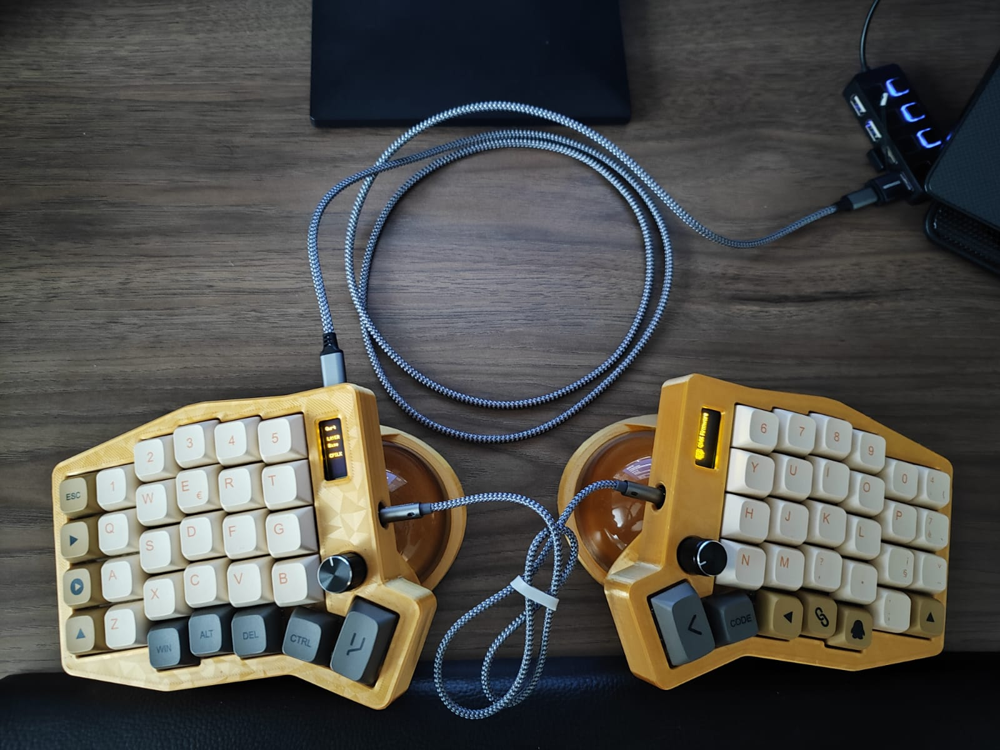
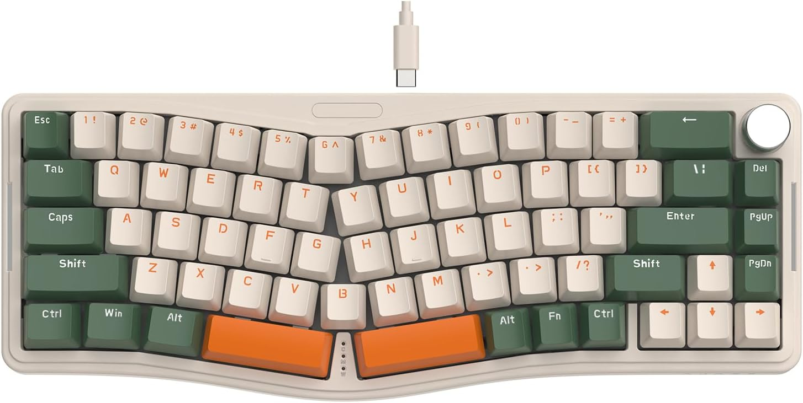

:::{.cell}
{fig-align="center"}
:::

I am one of those programmers who type at list 8 hours per day and still prefer shopping on a PC rather than on a phone rsrs. Yes, I need the big screens. 

Even tough I did not count my words per minute (wpm), I considered myself a good typist with my 100% keyboard: I was able to memorize the shortcuts that I needed and did not have to look on the keyboard to type.

But as time goes by, I started to feel that my hands started to get rust, like some oil was missing between my hand bones 🤖. Three years later, I paid US$ 100 in an ultrasound that showed me that I had tendonitis 🤕. I started to the physiotherapy for my wrist, which gave me some relief, but at the end of day, I felt sour on my right hand due to labour. 

So, I started to look for a new keyboard. I was willing to buy a simple used mechanical keyboard; it would be a lot better than my membrane keyboard. But the pain would still remain. Then, I decided to buy an [Ajazz Alice AKS068 Pro](https://pt.aliexpress.com/item/1005006865102078.html) from a Brazilian Fellow online:

:::{.cell}
{width="560" height="315" fig-align="center"}
:::

+ The price was great.
+ The change would be small because it is a 70% keyboard.
+ I loved the colors.
+ There was a Knob button that I would use as a volume controller.
+ It was "ergonomic".

**HOWEVER**, he did not want to send the keyboard over mail. 

Then, I found pricy this keyboard new, here is way:

+ The keyboard was not ergonomic at all -> It only had curved keys in a fixed position;
+ As time passed by, the pain increased, and I felt that I need something more complete;

A week or later I discovered the Moonlander keyboard from [Fabio Akita](https://www.youtube.com/watch?v=78aw1muYWQM&ab_channel=FabioAkita), for US$ 400, no way. But I realized that this was the kind of technology that I needed. So I did a vast research and I found out that [eFeXx](https://www.youtube.com/watch?v=hh0g3yHTxIQ&ab_channel=eFeXxTech%2CKeyboardseDesabafos) built a Sofle v2 keyboard by himself step by step. There was even a ready to go shop list. With this keyboard I would have **a real ergonomic keyboard, that's way**:

+ The keys are columns oriented: They respect the different length of the fingers.
+ The thumb finger receives 3 keys to use on each split. Being it the strongest finger is a waste to use only for space in a regular keyboard.
+ I could place the keyboard at any angle that I wanted: as long as I respect the ergonomics.
+ The splits can be placed far apart from which other.

It also has two knobs (one for volume and another for page up/down), two screens, and can be powered with leds, bluetooth and [much more from the creator](https://github.com/josefadamcik/SofleKeyboard/tree/master/Sofle_v2_soldered). But it was not still perfect, here is way: the case for the keyboard on the [video]((https://www.youtube.com/watch?v=hh0g3yHTxIQ&ab_channel=eFeXxTech%2CKeyboardseDesabafos)) did not work and had to used a flat one. 

That's when my [friend Seiji](@https://br.linkedin.com/in/b-seiji-fujihara-b80790a3) enters into the history. I got so excited about building my own keyboard, that I not only convinced him to make one for himself, but he also developed an angled support case based on [this one](https://www.printables.com/model/468215-sofle-v2-case-and-stand), with a better support for the PCB. This was the *Gran Finale* of ergonomics manual.

Then, the next step was to buy all the parts from *AliExpress*, one by one, and assemble them together:

  <iframe width="560" height="315" 
    src="https://www.youtube.com/embed/9bxAry_URpE" 
    title="YouTube video player" frameborder="0" 
    allow="accelerometer; autoplay; clipboard-write; encrypted-media; gyroscope; picture-in-picture" 
    allowfullscreen>
  </iframe>

This whole process took me 1 full Saturday and other 3 months of "CI/CD" that I had to fix some welds. Considering that I had no previous experience on weld, it was a learning process, and I liked.

This is what I got from this process:

1. I made a new friendship! Not only one, two: [Paludo](https://josepaludo.dev.br/) showed me his lilly keyboard and all the advantages of having a split keyboard.
2. Learned how to (and not to) weld.
3. I recommend it, specially if you are familiar with weld;
4. Like when we are new to programming, when I finished, I figured out that there was a better way to make it. I could have saved a lot money and time if I had bought a [ready to build sofle RGB mx kit2](https://pt.aliexpress.com/item/1005008498202663.html) by 50 US$. But as part of my learning, I could not know that it would work before doing it.
5. Lots of stories for a sunday in family.
6. A Blog post 😂;

This whole process made me remember that, to be a master, you gotta get your hands dirty!

Now, better coding, with better keyboards!!

