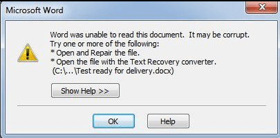
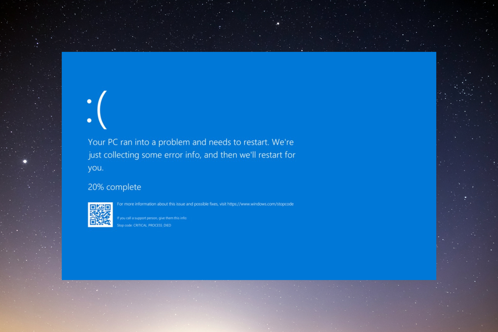

:::{.cell}
{fig-align="center"}
:::

## Introduction

During my undergraduate studies, my professor [Paulo Justiniano](http://leg.ufpr.br/~paulojus) always incentivized the students for using any Linux distribution on their machines. The reasons were vast, but I will give the details later on.

I never tried it before because:

1. I was comfortable using Windows because I used this operational system on my internship and at home
2. I did not have a personal laptop at the beginning of university.

On my last year of college, I bought one with Windows pre installed, and I was using as it is (knowing that migrating to Ubuntu would be better). But the day came!

## The Day

I remember like it was today. It was during the time that everyone was migrating from Windows 8.1 or 10. I was working on a report, had worked the full day on it, and then I decided to migrate to Windows 10. The migration finished successfully, I opened the file, started typing a few more words, and then, out of nothing **my report became corrupted**:

:::{.cell}
{fig-align="center"}
:::

I could not save or send my report to anywhere, and I received the famous blue screen:

:::{.cell}
{fig-align="center" width="560" height="400"}
:::

I had to turn off and on my PC using the power button, but I could not see the original content of the file anymore. It was gone. At the same time, I downloaded the Mint iso file, burn into a Pen Drive, installed it and started using.

It was not only flowers at the beginning, as usual. My friend Augusto Colombo helped my in the lab to install and do the basics. Some weeks later, and I did not like the Mint, so I swap to Ubuntu.

## The redemption

With Ubuntu everything fell into place. All the troubles that I had when tried a fresh install on Mint it was solved on Ubuntu, and I could fix by my self.

It really represents the meaning of Ubuntu, from African: "I am what I am because of who we all are". Ever since then I use ubuntu on my personal laptop and in my current job. It is so amazing.

It gives **many advantages** for me compared to the time I had Windows:

1. I know how to do a fresh install when needed.
2. It is free to use. Don't need to pay any license.
3. It hardly enters a virus.
4. The performance does not go down over time.
5. There is a full community open to help.
6. Due to the fact that most of installation is made via CLI, it opens your mind to shell, to automate your repetitive tasks.
7. The hard drive is portable. I can remove from my PC and plug it into another. It will not crash.

When we talk specifically about **Data Science tasks**, I can list:

1. Python is pre-installed on Ubuntu.
2. Docker only runs on Ubuntu machines.
3. Almost every server in the world uses a distro based on Linux. Choosing a server on EC2, it is like to choose which Linux you want to use. Using Ubuntu daily means that when I need to access servers, I am more familiar with the operational system.
4. Installation of tools for data science such as R, Python, dependencies are usually easily handed on Ubuntu.
5. A common task on a DS work is to tell the path you files are. If you are on Windows, you need to copy the path, paste on a Editor and make the back slash into forward the slash, or double it. With Ubuntu, you do not. You use as it is.

The only thing that sometimes I miss on Ubuntu is the Office package. But using Libre Office is lighter, free and it is a good alternative full of customizations.

## Considerations

I am aware that the latest Windows release have become better, such that, WSL (Windows Subsystem for Linux) became available and Windows 10 is stable now. From another point of view, Ubuntu has now Steam for gaming, but it is still not ideal when you want a full gaming experience. In the end of the day, it is always a matter of which operational system suits you best: just like for designers that love Apple.

With all that given, it would be nice if we could choose the operational system that fits better our role, instead of going to the usual operational system.

Maybe we can reach a day that:

Leave in the comments any thoughts about it!

Happy coding!
